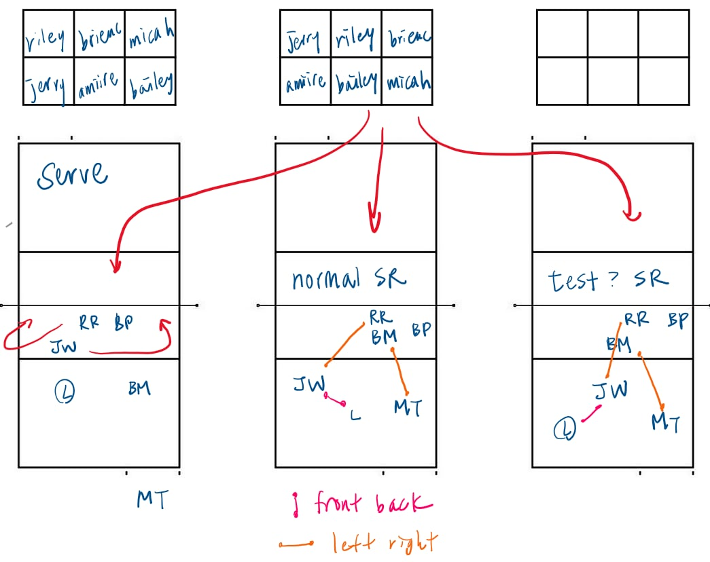

# Volleyball Rotation Visualizer

A full-stack web app for volleyball coaches and players to visualize, customize, and save rotation diagrams — replacing paper and whiteboard sketches with an interactive, exportable digital tool.

**Link:** https://volleyballrotationsvisualizer.vercel.app/

**Demo:** https://www.youtube.com/watch?v=ri8m4e22H6w

**Demo account:** Available on request

---

## Table of contents

- [The problem](#the-problem)
- [Examples](#examples)
- [Features](#features)
- [Tech stack](#tech-stack)
- [Architecture overview](#architecture-overview)
- [Key design decisions](#key-design-decisions)
- [How it works end-to-end](#how-it-works-end-to-end)
- [Setup instructions](#setup-instructions)
- [Environment variables](#environment-variables)
- [Future improvements](#future-improvements)

---

## The problem

Volleyball teams run structured rotation systems (5-1, 6-2) but frequently need to customize them — adjusting for weak rotations, opponent matchups, or specific player combinations. Coaches today draw these diagrams on paper or whiteboards every season, from scratch, with no way to save, reuse, or share them.

This tool lets coaches build custom rotation diagrams interactively, preview matchups against an opponent's lineup, and export everything as a one-page PDF — so diagrams created this season are reusable next season.

---

## Examples

### Visualizer

Here is a real plan that my coach sent to me as a player:



### 5–1 Basics
[](https://www.youtube.com/watch?v=pi7Lf6uO7dE)

### 6–2 Basics
[](https://www.youtube.com/watch?v=Prfbkz73d3Q)

**Credit:** [SD Volleyball Videos](https://www.youtube.com/@SDVolleyballVideos)


## Features

- **Interactive court** — Drag players on a canvas court, draw arrows or custom routes, with rotation rule enforcement (players cannot swap with non-diagonal neighbors)
- **5-1 and 6-2 support** — Switch between the two universally used rotation systems, with all 6 rotations per system
- **Plan ahead** — Compare two teams' rotations side by side to preview blocking and serving matchups
- **Save lineups and configs** — Store and reload lineups and rotation configurations per account
- **PDF export** — Export a one-page rotation sheet (tables + court diagrams) directly from the browser
- **Works without an account** — Full visualizer and plan-ahead available without sign-in; sign in to save and sync

---

## Tech stack

| Layer | Technology |
|-------|-----------|
| Frontend | React, TypeScript, Vite |
| Canvas | react-konva |
| Auth | Firebase Auth |
| PDF export | pdf-lib |
| Backend | FastAPI |
| Database | PostgreSQL via Supabase |
| Frontend hosting | Vercel |
| Backend hosting | Railway |

---

## Architecture overview

```
Browser (Vercel)
│
├── React (TypeScript + Vite)
│   ├── react-konva court (canvas)
│   ├── Firebase Auth SDK (ID token management)
│   └── pdf-lib (PDF generation, client-side)
│
└── Firebase bearer token on every API request
        │
        ▼
Railway (FastAPI)
├── Firebase JWT verification (stateless, via JWKS)
└── SQLAlchemy
        │
        ▼
Supabase (PostgreSQL)
├── lineups (user_id, name, lineup JSONB)
└── visualizer_configs (user_id, name, system, rotations JSONB)
```

The frontend is a static single page application deployed on Vercel. When the user signs in, Firebase issues an ID token that the frontend attaches to every backend request. The backend verifies the token against Firebase's public endpoint — no sessions. From that, the backend can retrieve the user's firebase UID. Data is stored in PostgreSQL on Supabase, keyed by Firebase `uid`.

---

## Key design decisions

### react-konva for the court

The court needed to support draggable players, freehand and arrow drawing, and clean rendering on both desktop and mobile browsers. I chose react-konva (a React binding for the Konva canvas library) over SVG or DOM-based approaches because draggability is built in (no need for manual hit testing or coordinate math), arrow drawing is just a state update as the user moves the mouse pointer, and the react-konva cavas is vector based, allowing for clean resizing with no pixelation, very important since I want my app to be used on mobile.

### Firebase Auth over other Auth methods:

- Firebase's ID tokens are standard JWTs verified statically against Firebase's JWKS public keys. The backend stays fully stateless. This greatly simplifies my database and backend, as no session information is needed.
- Firebase handles token refresh automatically in the SDK, email verification, password reset, and Google sign-in with minimal configuration.

### PostgreSQL + FastAPI over a Firebase-only backend

Firebase's Firestore is a good fit for simple, denormalized document data. Rotation data has relational structure — users, lineups, configs, and eventually teams and shared rotations. Postgres handles this cleanly with querying, and indexing. With roughly 50,000 volleyball coaches in the US as a potential user base, a relational database is the right long-term foundation.

### JSONB for rotation and lineup payloads

Rotation data (player positions per rotation) and lineup data are semi-structured and may evolve as features are added. Storing them as JSONB in Postgres gives flexibility without losing the ability to query, index, or filter on structured fields like `user_id`, `name`, or `system`.

### Client-side PDF generation

PDF export is handled entirely in the browser with `pdf-lib`. This keeps the backend stateless and avoids sending canvas data or large payloads over the network. The tradeoff is limited control over layout complexity, but for a one-page rotation sheet it's sufficient.

### Managed infrastructure

Vercel (frontend), Railway (backend), and Supabase (database) were chosen for minimal operational overhead and free tiers. The tradeoff is reduced control and customization. At current scale this is good enough; migrating to self-managed infrastructure is something I will do if scale requires it.

---

## How it works end-to-end

1. Browser fetches the React app from Vercel.
2. User can use the visualizer and plan-ahead immediately.
3. When a user successfully authenticates, Firebase issues an ID token (JWT, 1-hour expiry, auto-refreshed by the SDK). The frontend stores this and attaches it as a bearer token on every API request. The backend is able to obtain the user's firebase UID with this token with a public endpoint.
4. User selects a system (5-1 or 6-2) and rotation (1–6), optionally loads a saved lineup, and drags players on the court. Rotation rules are enforced client-side. Annotations (arrows, freehand drawings) are stored in component state.
5. Lineup and config saves hit `POST /lineups` or `POST /configs`. The backend verifies the token, extracts `uid`, and writes to Postgres. Subsequent loads hit `GET /lineups` or `GET /configs`, filtered by `uid`.
6. In the plan ahead tab, the user sets two teams (lineup, system, starting rotation, serve side). Two read-only courts render side by side, showing blocking and serving matchups.
7. `pdf-lib` renders the current rotation tables and court diagrams in the browser and either downloads the PDF or shows a preview.

---

## Setup instructions

### Prerequisites

- Node.js 18+
- Python 3.12+
- A Firebase project with Auth enabled
- A Supabase project with the tables below created

### Database setup (Supabase)

Run in the Supabase SQL editor:

```sql
create table lineups (
  id uuid primary key default gen_random_uuid(),
  user_id text not null,
  name text not null,
  payload jsonb not null,
  show_number boolean default true,
  show_name boolean default false,
  created_at timestamptz default now(),
  updated_at timestamptz default now()
);

create table visualizer_configs (
  id uuid primary key default gen_random_uuid(),
  user_id text not null,
  name text not null,
  system text not null,
  rotations jsonb not null,
  created_at timestamptz default now(),
  updated_at timestamptz default now()
);
```

### Install and run

```bash
git clone https://github.com/jwu2002/Volleyball-Rotation-Visualizer.git
cd Volleyball-Rotation-Visualizer

# Frontend
cd frontend && npm install

# Backend
cd ../backend
python -m venv .venv
.venv\Scripts\activate     # Windows
# source .venv/bin/activate  # macOS/Linux
pip install -r requirements.txt
```

### Environment variables

**`backend/.env`**
```
DATABASE_URL=postgresql+asyncpg://...  # Supabase connection string
FIREBASE_PROJECT_ID=your-project-id
CORS_ORIGINS=http://localhost:5173
RATE_LIMIT=20/minute
```

**`frontend/.env.local`**
```
VITE_API_URL=http://localhost:8000
VITE_FIREBASE_API_KEY=...
VITE_FIREBASE_AUTH_DOMAIN=...
VITE_FIREBASE_PROJECT_ID=...
VITE_FIREBASE_STORAGE_BUCKET=...
VITE_FIREBASE_MESSAGING_SENDER_ID=...
VITE_FIREBASE_APP_ID=...
VITE_FIREBASE_MEASUREMENT_ID=...
```

### Run

```bash
# Backend
cd backend && uvicorn main:app --reload --port 8000

# Frontend (separate terminal)
cd frontend && npm run dev
```

Open `http://localhost:5173`.

---

## Future improvements

- Live game tracking — track score and rotation in real time during a match
- Mobile app — React Native port for iOS and Android, apps on App store and Google play store
- Team accounts — share lineups and configs across a coaching staff
- Opponent scouting — save and reuse opponent lineups across seasons